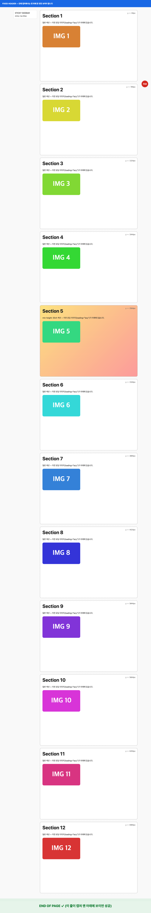

# Full Page Clip

단축키 한 번으로 **현재 탭의 전체 페이지(스크롤 맨 아래까지)** 를 캡처해서 **클립보드에 PNG로 복사**하는 Chrome 확장 프로그램입니다.
PDF로 인쇄하거나, 스크롤하며 여러 장 찍을 필요 없이 바로 다른 앱/채팅창에 `⌘V` (Windows: `Ctrl+V`) 로 붙여넣으면 됩니다.

> **English:** A Chrome extension that captures the *entire* page (down to the very bottom) with one keyboard shortcut and puts it on the clipboard as a PNG, ready to paste into any app or chat with ⌘V / Ctrl+V. Works on macOS, Windows and Linux. Install via `chrome://extensions` → Developer mode → *Load unpacked*.

- macOS / Windows / Linux 의 Chrome(및 Chromium 계열: Edge, Brave 등)에서 동작합니다.
- 설치 후 기본 단축키: **macOS `⌘⇧S`**, **Windows/Linux `Ctrl+Shift+S`** (변경 가능)
- 툴바의 확장 아이콘을 클릭해도 똑같이 캡처됩니다.

<p align="center">
  
</p>

## 설치 (Mac / Windows 동일)

1. 이 저장소를 받습니다. 아래 명령 또는 GitHub의 **Code → Download ZIP** (압축 해제).

   ```bash
   git clone https://github.com/thddydgnl/full-page-clip.git
   ```

2. Chrome 주소창에 `chrome://extensions` 를 입력해 엽니다.
3. 오른쪽 위 **개발자 모드** 를 켭니다.
4. **압축해제된 확장 프로그램을 로드합니다** 를 누르고 받은 폴더(`full-page-clip`)를 선택합니다.
5. 툴바 퍼즐 아이콘 → **Full Page Clip** 을 고정(핀)해 두면 아이콘 클릭으로도 캡처할 수 있습니다.

> 폴더를 옮기거나 지우면 확장이 사라지니, 원하는 위치에 둔 뒤 로드하세요.
> 코드를 수정했다면 `chrome://extensions` 에서 새로고침(↻) 버튼을 눌러야 반영됩니다.

## 단축키 바꾸기

`chrome://extensions/shortcuts` 에서 **Full Page Clip → 전체 페이지를 캡처해서 클립보드에 복사** 항목에 원하는 키를 지정하세요.
(확장 설정 페이지의 "단축키 변경 페이지 열기" 버튼으로도 갈 수 있습니다.)
기본 키가 다른 확장과 겹치면 Chrome이 자동으로 비워 두므로, 그 경우 직접 지정해야 합니다.

## 사용법

1. 캡처할 페이지에서 단축키를 누릅니다 (또는 툴바 아이콘 클릭).
2. 탭 위에 노란 **"확장 프로그램이 이 브라우저를 디버깅하기 시작했습니다"** 바가 잠깐 나타났다가 사라집니다. 정상입니다 (전체 페이지를 그리기 위해 Chrome의 DevTools 프로토콜을 잠깐 씁니다).
3. 오른쪽 위에 `전체 페이지 복사 완료 · 1280×7670px · ⌘V 로 붙여넣기` 토스트가 뜨면 끝입니다. 보통 1~4초 걸립니다.
4. 채팅창/문서/메신저에 붙여넣습니다.

클립보드 복사에 실패하면(예: 주소창에 포커스가 있을 때) 자동으로 **PNG 파일로 다운로드**하고 토스트로 알려줍니다.

## 설정

툴바 아이콘 우클릭 → **옵션** (또는 `chrome://extensions` → Full Page Clip → 세부정보 → 확장 프로그램 옵션)

| 항목 | 기본값 | 설명 |
| --- | --- | --- |
| 캡처 방식 | 자동 | 뷰포트 확장 방식을 쓰고, 화면 높이(vh)에 따라 계속 커지는 페이지면 스크롤 이어붙이기로 자동 전환 |
| 캡처 해상도 | 1배 | 1배 = 화면 폭과 같은 픽셀 폭(채팅 붙여넣기용 권장). "화면 배율 그대로"는 레티나에서 2배 크기 |
| 최대 높이 | 20000px | 이보다 긴 페이지는 여기까지만 캡처 (0 = 제한 없음) |
| 지연 로딩 미리 불러오기 | 켬 | 캡처 전에 페이지를 한 번 끝까지 훑어 lazy-load 이미지를 로드 |
| 완료/오류 메시지 표시 | 켬 | 페이지 위 토스트 |
| PNG 파일로도 저장 | 끔 | 클립보드 복사와 함께 다운로드 폴더에 저장 |

## 동작 방식 (간단히)

1. 페이지 안에 작은 도우미 스크립트를 넣고, 지연 로딩 이미지를 미리 불러옵니다.
2. `chrome.debugger` 로 탭에 붙어 **뷰포트를 문서 전체 높이로 키운 뒤**(`Emulation.setDeviceMetricsOverride`) 4000px 단위로 `Page.captureScreenshot` 합니다. 고정 헤더/플로팅 버튼은 한 번만 나옵니다.
   - 뷰포트를 키우면 문서가 같이 커지는 페이지(`100vh` 히어로, `min-height: 50vh` 섹션 등)는 자동으로 감지해서 **실제 화면 크기로 한 화면씩 스크롤하며 캡처**하고(고정 요소는 첫 화면 이후 숨김, sticky 요소는 제자리 고정), 이어붙입니다.
   - 창이 아니라 내부 컨테이너가 스크롤되는 앱형 레이아웃도 지원합니다.
3. 디버거를 떼고, 페이지 안에서 조각들을 캔버스에 합쳐 PNG로 만든 뒤 `navigator.clipboard.write` 로 복사합니다.
   `http://` 페이지처럼 클립보드 API를 쓸 수 없는 곳에서는 확장 프로그램 자체 iframe(보안 컨텍스트)을 통해 복사합니다.

## 제한사항 / 문제 해결

- **DevTools(개발자 도구)가 열린 탭**에서는 캡처할 수 없습니다 → 닫고 다시 시도. 다른 디버깅 확장(예: Claude in Chrome이 작동 중인 탭)도 같은 제한이 있습니다.
- `chrome://` 페이지, Chrome 웹 스토어, 다른 확장 프로그램 페이지, PDF 뷰어는 캡처할 수 없습니다.
- `file://` 페이지는 `chrome://extensions` → Full Page Clip 세부정보 → **파일 URL에 대한 액세스 허용** 을 켜야 합니다.
- 매우 긴 페이지는 **최대 높이** 설정까지만 캡처되며 토스트에 "아래쪽이 잘렸습니다"가 표시됩니다. 무한 스크롤 피드도 마찬가지입니다.
- 채팅 서비스(Claude, ChatGPT 등)는 아주 큰 이미지를 축소해서 읽습니다. 글자가 작아 보이면 최대 높이를 줄이거나 필요한 부분만 캡처하세요. 1배 해상도가 기본인 이유도 이것입니다.
- "클립보드 복사 실패"가 뜨면 페이지 본문을 한 번 클릭해(포커스) 다시 시도하세요. 그래도 안 되면 PNG가 다운로드 폴더에 저장되어 있습니다.
- 캡처 순간 페이지 크기가 바뀌므로, 창 크기에 반응해 애니메이션하는 사이트는 결과가 조금 다를 수 있습니다. 이럴 땐 설정에서 **스크롤 이어붙이기** 를 선택해 보세요.

## 개발 / 테스트

의존성 없이 순수 JS(Manifest V3)로 되어 있습니다.

```
full-page-clip/
├── manifest.json        확장 매니페스트 (권한: activeTab, debugger, scripting, storage, clipboardWrite)
├── background.js        서비스 워커: 단축키 처리, DevTools 프로토콜 캡처, 페이지 안 도우미 코드
├── clipboard.html/.js   http:// 페이지용 클립보드 폴백 iframe
├── options.html/.js     설정 페이지
├── icons/               아이콘 (scripts/make-icons.py 로 생성)
├── docs/                README용 예시 이미지
├── LICENSE              MIT
├── scripts/make-icons.py
└── test/
    ├── e2e.mjs          자동 테스트: Chromium을 띄워 캡처하고 클립보드 이미지를 검증 (macOS)
    ├── test-page.html   긴 페이지 (고정 헤더, sticky, lazy 이미지, 50vh 섹션)
    ├── test-hero.html   100vh 히어로 페이지 (스크롤 방식 자동 전환 확인)
    └── test-scroller.html  내부 컨테이너 스크롤 레이아웃
```

자동 테스트 (Node 22+ 와 Chromium/Chrome for Testing 필요 — Playwright나 Puppeteer가 받아 둔 것을 자동으로 찾습니다):

```bash
node test/e2e.mjs
```

```bash
node test/e2e.mjs --page test-hero.html --scale device --zoom 1.25
```

테스트는 확장을 임시 폴더에 복사하면서 `host_permissions`를 추가한 뒤 서비스 워커의 `run()`을 직접 호출합니다
(합성 키 입력으로는 Chrome 확장 단축키를 발동시킬 수 없기 때문). 실제 사용 시에는 단축키/아이콘 클릭이 `activeTab` 권한을 부여하므로 추가 권한이 필요 없습니다.
브랜드 Google Chrome 137+ 는 `--load-extension` 을 무시하므로 테스트에는 Chrome for Testing 또는 Chromium을 쓰세요.

## 라이선스

[MIT](LICENSE)
